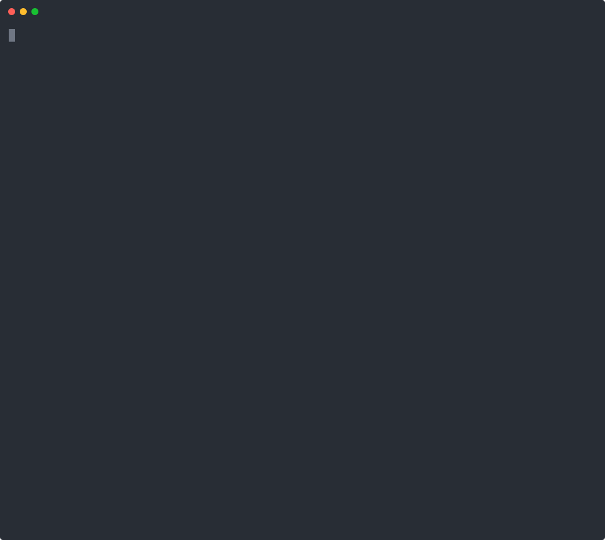

# Zion Edge Gateway

<!-- Build status -->
[](https://github.com/fabriziosalmi/zion/actions/workflows/ci.yml)
[](https://github.com/fabriziosalmi/zion/actions/workflows/supply-chain.yml)
[](https://github.com/fabriziosalmi/zion/actions/workflows/codeql.yml)

<!-- Security & compliance certifications -->
[](https://slsa.dev/spec/v1.0/levels#build-l3)
[](https://www.bestpractices.dev/projects/12756)
[-success.svg)](docs/security/fips.md)
[](docs/security/asvs.md)

<!-- Project metadata -->
[](https://github.com/fabriziosalmi/zion/releases)
[](Cargo.toml)
[](https://github.com/fabriziosalmi/zion/blob/master/LICENSE)

<!-- Capabilities -->
[-success?style=flat&color=brightgreen)](https://github.com/fabriziosalmi/zion/tree/master/benchmarks)
[](https://github.com/fabriziosalmi/zion/blob/master/src/waf.rs)

<p align="center">
  
</p>

**Zion is a single-binary TLS reverse proxy with a built-in WAF, RAM cache, and a
sovereign edge toolkit — written in Rust.** It terminates TLS 1.3, scans every
request with a zero-regex WAF, serves hot assets from a two-level in-RAM cache,
and proxies the rest to your upstreams — with hot-reload, HTTP/1.1·2·3, and
Prometheus metrics out of the box. No sidecars, no GeoIP database, no control
plane.

**Use it when** you want one auditable Rust binary at the edge instead of a stack
of nginx + a WAF module + a cache + a geo-tagger — and you want explicit knobs,
not an auto-magic black box.

```bash
cargo build --release --features init,tui
./target/release/zion auto --upstream :3000   # ephemeral cert + config, TLS proxy live in seconds
```

---

## Quick start

Fastest path — TLS in front of a dev backend, one command:

```bash
cargo build --release --features init,tui
./target/release/zion auto --upstream :3000          # generates ephemeral cert + config, runs daemon
```

Zero-config, ~30 s to a production-style setup:

```bash
./target/release/zion init        # interactive wizard: detects local ports, generates zion.toml + self-signed cert
./target/release/zion doctor      # environment check (fd limit, kernel, AES, port-bind perms)
ZION_CONFIG=zion.toml ./target/release/zion        # run
./target/release/zion top         # live dashboard (in another terminal)
```

Unattended (CI / container init):

```bash
./target/release/zion init -y \
    --hostname api.example.com \
    --upstream backend=127.0.0.1:8000 \
    --upstream frontend=127.0.0.1:3000
```

### Migrating from nginx

Already running nginx? Convert an existing config instead of hand-writing one:

```bash
zion import nginx /etc/nginx/sites-enabled/app.conf -o zion.toml
```

`import` translates the reverse-proxy subset of nginx into a **validated**
`zion.toml` and prints an honest findings report — every directive lands in
exactly one bucket (convert / partial / auto / unsupported), and anything Zion
cannot express faithfully is flagged loudly, never silently mistranslated
([ADR-0011](docs/adr/0011-zion-import-nginx.md)).

The claim is not taken on faith. The **equivalence harness** starts real nginx
and real Zion side by side on the original and converted configs, replays a
request corpus against both, and diffs the routing decision request by request
— the intentional differences are exactly the ones the report declared:



Reproduce it yourself (`docker`, `curl`, `openssl`): `./tests/equivalence/run.sh`
— see [tests/equivalence/](tests/equivalence/).

### Automatic HTTPS (Let's Encrypt)

The release binary and official container ship automatic HTTPS. Scaffold a
production config for a public domain and Zion obtains and auto-renews a real
certificate on first boot — no manual cert step:

```bash
zion init --hostname app.example.com --email ops@example.com
ZION_CONFIG=zion.toml zion         # gets a real cert on boot; renews itself
```

`zion init` writes a `[tls.acme]` block and a short-lived bootstrap cert so
`:443` binds instantly while ACME provisions the real one (needs port 80
reachable for the HTTP-01 challenge). A local `cargo build` needs
`--features acme` (or `--features dist`); the released artifacts already
include it. See [ACME docs](https://fabriziosalmi.github.io/zion/config/acme).

### Build flavors

The default build is a lean daemon; opt into what you need:

```bash
cargo build --release                            # bare daemon
cargo build --release --features init            # + zion init wizard / zion auto dev mode
cargo build --release --features tui             # + zion top live dashboard
cargo build --release --features dist            # release bundle: acme + init (what the container ships)
cargo build --release --features acme            # + automatic HTTPS via Let's Encrypt (HTTP-01)
cargo build --release --features auth            # + JWT/OIDC authentication gate
cargo build --release --features http3           # + HTTP/3 QUIC listener
cargo build --release --features otel            # + OpenTelemetry tracing + OTLP export
cargo build --release --features fips            # + FIPS 140-3 build (aws-lc-rs validated backend)
cargo build --release --features geo-ita         # + Italian / EU sovereign edge classification
cargo build --release --features io-uring-accept # Linux 5.19+: single-shot accept
cargo build --release --features numa-aware      # + per-NUMA-node DashMap sharding (Linux multi-socket)

# "max" build
cargo build --release --features init,tui,acme,auth,http3,otel
```

## Configuration

```toml
[server]
listen_http = "0.0.0.0:80"
listen_https = "0.0.0.0:443"
# Outbound X-Forwarded-For policy: "append" (default), "rewrite", "drop".
# Use "rewrite" when Zion is the front edge — it strips inbound XFF and
# emits a single trusted entry (the resolved client IP).
xff_mode = "append"

[tls]
cert_path = "/etc/ssl/zion/tls.crt"
key_path = "/etc/ssl/zion/tls.key"

[upstreams]
backend = "http://127.0.0.1:8000"
frontend = "http://127.0.0.1:3000"

# WAF profile (named, assignable per route). "balanced" is the high-precision
# default; "aggressive" adds broad-substring patterns for higher recall.
[waf_profile.api]
mode = "balanced"
max_body_mb = 10
entropy_check = true
entropy_threshold = 6.5

[[route]]
path = "/api/{*rest}"
upstream = "backend"
waf_profile = "api"

[[route]]
path = "/_next/static/{*rest}"
upstream = "frontend"
mode = "static_cache"

[[route]]
path = "/{*rest}"
upstream = "frontend"
```

`zion.toml` is **hot-reloaded**: edit routes, upstreams, WAF profiles, CORS,
rate limits, or even the **listen ports** and save — the daemon atomic-swaps the
new config (and rebinds listeners, draining the old ones) without dropping
in-flight connections. Invalid configs are rejected; the previous state
survives. See [zion.example.toml](zion.example.toml) for the full reference and
[hot-reload docs](https://fabriziosalmi.github.io/zion/deploy/hot-reload).

## Architecture

```text
Client -> TLS 1.3 -> Security Gates -> Radix Router -> WAF Pipeline (5 gates) -> Proxy/Cache -> Upstream
                         |                                |
                    URI limit                  Aho-Corasick (~100 balanced / ~240 aggressive)
                    Method whitelist           Entropy analysis (JSON-string-only)
                    Rate limiter               simd-json validation
                    CORS pre-flight            Depth/size limits
```

<!-- zion-stats:modules-lines (kept in sync by scripts/update-readme-stats.sh) -->
47 modules, ~39,300 lines of Rust. See [architecture docs](https://fabriziosalmi.github.io/zion/guide/architecture) for the full module map and request lifecycle.

## Features

**Core proxy**
- TLS 1.3 termination (rustls + hardware AES-NI / AES-CE)
- HTTP/1.1, HTTP/2, HTTP/3 QUIC (`--features http3`); HTTP/2 upstream multiplexing
- Multi-SNI with per-domain certificates (FNV O(1) lookup)
- Zero-downtime TLS, QUIC, and full-config hot-reload (ArcSwap + watch channels) — including live listener rebind
- Session tickets + 0-RTT early data with method gating (425 Too Early, RFC 8470)
- WebSocket proxy (bidirectional pipe, TLS-to-upstream) and zero-buffer SSE streaming
- ACME auto-renewal (`--features acme`); JWT/OIDC auth gate (`--features auth`)

**Cache** — two-level RAM cache: L1 thread-local (O(1) intrusive-LRU) + L2 sharded DashMap, generation-based coherence (no stale data after update), request coalescing (singleflight: N concurrent misses → 1 upstream fetch). Honors the origin's `Cache-Control`, emits `Age` and an `X-Zion-Cache: HIT|MISS|BYPASS` decision header, and exposes a `POST /_zion/cache/purge` flush for deploys.

**WAF (zero-regex, O(N) single-pass)** — Aho-Corasick scanner, two pattern sets (`balanced` ~100 high-precision / `aggressive` ~240 broad-recall), Shannon-entropy analysis (JSON-string-only), simd-json structural limits, Content-Type enforcement, iterative normalization (URL-decode / SQL-comment / unicode), mTLS `X-Client-Cert-Fingerprint` forwarding, and a shadow mode (log + count, never block).

**Security** — HSTS preload, nosniff, frame-deny, Referrer-Policy, Permissions-Policy, per-route CSP; `Server`/hop-by-hop stripping (RFC 7230); URI-length cap + 7-method whitelist; per-IP rate limit **and** per-IP concurrent-connection cap (enforced at accept); CORS (FNV O(1)); header-bomb limits (64 headers / 16 KB).

**Observability** — `/healthz` · `/readyz` fast-path (~1 µs), `/metrics` Prometheus (lock-free sharded counters), `X-Request-ID` + W3C `traceparent` propagation, structured text/JSON logs, and the `zion top` live TUI.

**Operations** — fail-fast config validation, graceful 30 s drain, adaptive upstream recovery (decorrelated-jitter backoff: a recovered origin returns in ~1.4 s vs up to 30 s), boot-time platform auto-detection + performance-tier calibration, `zion doctor` diagnostics, TCP tuning (NODELAY / DEFER_ACCEPT / FASTOPEN / QUICKACK), systemd unit + Docker HEALTHCHECK.

**Opt-in tracks (feature-gated, default-off)**
- **kTLS offload** (`--features ktls`, Linux 5.10+) — *experimental*: flips the socket into in-kernel TLS after handshake toward `sendfile`-class zero-copy. The offload is wired but not yet exercised end-to-end in CI (issue #52).
- **ML-augmented WAF** (`--features ml-waf`) — *experimental*: 16-dim tract-onnx scorer on the WAF hot path (200 µs p99 budget), advisory metric/header — never a hard gate. Ships no bundled model.
- **AIMP serverless mesh** (`--features sovereign-aimp`) — Ed25519-signed UDP gossip of WAF deltas + IP reputation across a fleet, no central control plane.

## Sovereign edge & DDoS resistance

Zion is the **operator's toolkit at the edge** — sharp, composable primitives
with explicit knobs, each cheap enough to leave on under load. Defence is
layered, outside-in:

| Layer | Primitive |
|---|---|
| **L7 — pre-routing** | Zero-cost edge gates before any work: URI-length cap, method whitelist, XFF-spoof-resistant client-IP resolution. |
| **L7 — admission** | Per-IP **rate** limiter (`429` over budget) **and** per-IP **concurrent-connection** cap (enforced at accept, before the TLS handshake) — the lever a slow/backed flood actually hits. |
| **L7 — inspection** | WAF: zero-regex Aho-Corasick O(N) single-pass, entropy, simd-json limits, 5 gates. |
| **Origin tagging** | IT/EU range classification (`--features geo-ita` / `geo-eu`), IPv4 + IPv6 — O(log N) over baked CIDR data, **no GeoIP DB, no syscall**. Answers "% EU vs non-EU traffic" out of the box. |
| **Fleet signal** | AIMP mesh: Ed25519-signed gossip of blocks + reputation, source-bound revocation, no control plane. Reputation rides upstream as `X-Zion-Mesh-Score` — an advisory signal, not a gate. |
| **Tag-driven enforcement** | `[sovereign.enforce]` promotes the tag / mesh score from *signal* to an opt-in `403` deny (e.g. `deny = ["unknown"]` blocks non-EU sources; or deny above a reputation threshold). Off by default. |
| **L7 tarpit** | `[sovereign.enforce.tarpit]` escalates a deny from a cheap `403` to a *held* connection, so a flood pays wall-clock + socket budget; a global ceiling sheds back to `403` so it can't self-DoS. Off by default. |

The design rule: tagging and reputation never *silently* gate — the operator
opts a signal into enforcement explicitly; the local rate-limiter / WAF / auth
stay authoritative.

## Live dashboard (`zion top`)

With a daemon running, `zion top` opens an htop-style TUI: traffic counters,
latency quantiles (p50/p95/p99), status-class breakdown, cache hit rate, an RPS
sparkline, and per-upstream health.

```bash
zion top                                                    # default http://127.0.0.1:80/_zion/snapshot.json
zion top --url http://10.0.0.5:80/_zion/snapshot.json --interval 250
```

It polls `/_zion/snapshot.json` (internal-only; non-loopback IPs get 403). Keys:
`q` quit · `p` pause · `r` redraw.

## Performance

Indicative figures on an Apple M4 (end-to-end TLS 1.3 over loopback to a
zero-overhead hyper backend; median of 5×10 s `wrk` runs, c=100, **0 errors /
all 2xx**):

| Path | req/s |
|---|--:|
| TLS proxy (1–8 KB assets / API GET) | **~100–108k** |
| TLS proxy + WAF on every request | **~101k** |
| TLS + **cache hit** from RAM | **~190–222k** |

Against **nginx 1.27** under identical cgroup limits (Docker, 1 CPU / 256 MB,
HTTP/1.1 over TLS 1.3, byte-identical responses): nginx leads raw uncached proxy
by ~3–27%; Zion is at parity on API GET / WAF POST and **wins on cacheable assets
(+40–52%)** where the in-RAM cache skips the origin round-trip — all while
terminating TLS *and* running the WAF inline.

Numbers are a regression baseline on fixed hardware, not a WAN figure. The
canonical reproducible harness (throughput + nginx comparison + HTTP/2 & TLS
conformance + cache-correctness → a tracked PDF) lives under
[`benchmarks/baseline/`](benchmarks/baseline/); WAN-realistic distributed numbers
are in [`benches/e2e/`](benches/e2e/).

```bash
MODE=full bash benchmarks/baseline/run-baseline.sh   # → benchmarks/baseline/zion-<ver>-baseline.pdf
```

## Testing

<!-- zion-stats:test-count (kept in sync by scripts/update-readme-stats.sh) -->
**820 unit tests** run on every change; **23 integration tests** need a running Zion + a backend.

```bash
cargo test                          # unit tests

# integration tests (start a backend + Zion first):
#   cd benchmarks/backend && cargo run --release &
#   ZION_CONFIG=tests/zion-test.toml ./target/release/zion &
cargo test --test integration -- --ignored --test-threads=1
```

## Compliance & security docs

- [Threat model (STRIDE)](docs/security/threat-model.md) — surfaces, mitigations, residual risk
- [OWASP ASVS L2 mapping](docs/security/asvs.md) — control → implementation site → evidence
- [SOC 2 + FedRAMP control mapping](docs/security/compliance-mapping.md) — TSC + NIST 800-53 rev5
- [FIPS 140-3 build](docs/security/fips.md) — `--features fips` (validated AWS-LC backend)
- [TLS conformance](docs/security/tls-conformance.md) — BoGo / RFC 8446 / SSL Labs recipes
- [Supply chain](docs/security/supply-chain.md) — SLSA L3 provenance, cosign, SBOM
- [Mesh integration](docs/mesh/integration.md) — `--features sovereign-aimp` operator guide
- [Architecture Decision Records](docs/adr/) — the load-bearing choices, in writing

## Verifying a release

Every release is signed and carries SLSA v1.0 build provenance — see
[Supply Chain Security](docs/security/supply-chain.md). The short version:

```bash
# Binary release (Sigstore-backed provenance via gh CLI)
gh release download v0.6.2 -R fabriziosalmi/zion -p '*x86_64-unknown-linux-musl*' -p 'SHA256SUMS'
sha256sum --check --ignore-missing SHA256SUMS
gh attestation verify zion-v0.6.2-x86_64-unknown-linux-musl.tar.gz --owner fabriziosalmi

# Container image (cosign keyless)
cosign verify ghcr.io/fabriziosalmi/zion:v0.6.2 \
    --certificate-identity-regexp "^https://github.com/fabriziosalmi/zion/\\.github/workflows/release\\.yml@refs/tags/v" \
    --certificate-oidc-issuer "https://token.actions.githubusercontent.com"
```

## Changelog & license

See [CHANGELOG.md](CHANGELOG.md) for release history. Licensed under Apache-2.0 —
see [LICENSE](LICENSE) and [NOTICE](NOTICE).
