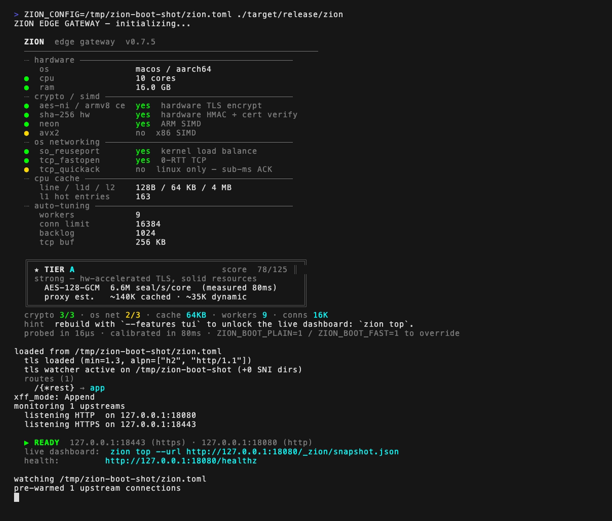

# Zion Edge Gateway

<!-- Build status -->
[](https://github.com/fabriziosalmi/zion/actions/workflows/ci.yml)
[](https://github.com/fabriziosalmi/zion/actions/workflows/supply-chain.yml)
[](https://github.com/fabriziosalmi/zion/actions/workflows/codeql.yml)

<!-- Security & compliance certifications -->
[](https://slsa.dev/spec/v1.0/levels#build-l3)
[](https://www.bestpractices.dev/projects/12756)
[-success.svg)](docs/security/fips.md)
[](docs/security/asvs.md)

<!-- Project metadata -->
[](https://github.com/fabriziosalmi/zion/releases)
[](Cargo.toml)
[](https://github.com/fabriziosalmi/zion/blob/master/LICENSE)

<!-- Capabilities -->
[](https://github.com/fabriziosalmi/zion/tree/master/benchmarks)
[](https://github.com/fabriziosalmi/zion/blob/master/src/waf.rs)

<p align="center">
  
</p>

High-performance TLS reverse proxy with built-in WAF, written in Rust.

## Performance

### Native Benchmark (Apple M4, Rust backend, 5 runs x 10s, c=100)

| Endpoint | Median req/s | Best Run | CV% | Errors |
|----------|-------------|----------|-----|--------|
| HTML SSR 5KB | **233,170** | 235,370 | 1.1% | 0 |
| CSS 3KB (cached) | **209,573** | 215,408 | 3.4% | 0 |
| Cache Hit JS 4KB (RAM) | **195,318** | 207,521 | 7.1% | 0 |
| TLS Proxy API GET 1KB | **106,505** | 107,189 | 2.1% | 0 |
| WAF POST JSON | **103,206** | 103,547 | 0.5% | 0 |
| JS 4KB (no cache) | **102,892** | 104,135 | 1.3% | 0 |
| PNG 8KB (no cache) | **99,496** | 101,290 | 1.7% | 0 |
| WOFF2 16KB (no cache) | **83,870** | 86,242 | 2.5% | 0 |
| SQLi blocked | Yes (400) | -- | -- | -- |
| XSS blocked | Yes (400) | -- | -- | -- |

**Peak**: 233K req/s HTML (TLS 1.3 e2e) -- 210K cache hit -- 107K API proxy -- 103K WAF POST (CV 0.5%)

Reproduce: `bash benchmarks/bench-native.sh`

### Fair Comparison with nginx (Docker, 1 CPU, 256 MB)

| Endpoint | nginx 1.27 | Zion TLS | Zion WAF | Zion Full | Best Delta | Errors |
|---|---|---|---|---|---|---|
| API GET (1KB) | 29,404 | 27,517 | 27,438 | 27,537 | -6.3% | 0 |
| HTML (5KB) | 25,657 | 52,581 | 53,016 | 53,368 | **+108.0%** | 0 |
| JS (4KB) | 23,152 | 18,165 | 18,037 | 32,366 | **+39.8%** | 0 |
| PNG (8KB) | 17,409 | 13,411 | 14,345 | 24,770 | **+42.3%** | 0 |
| WAF POST | 27,772 | 26,173 | 25,653 | 26,909 | -3.1% | 0 |
| CSS cached | 27,436 | 16,800 | 14,949 | 25,111 | -8.5% | 0 |

Full methodology: `bash benchmarks/bench-scientific.sh` (5 runs, CI95).

<details>
<summary>Throughput Matrix (Apple M4, Go backend, TLS 1.3, wrk)</summary>

Payload x concurrency grid -- measures end-to-end TLS throughput. These numbers use the Go backend (lower ceiling than Rust backend above).

| Mode | Payload | c=1 | c=10 | c=100 |
|---|---|---|---|---|
| **Dynamic** (Go backend) | 1 MB | 2,067 | 3,491 | 3,138 |
| | 10 MB | 323 | 406 | 203 |
| | 100 MB | 9,334 | 22,758 | 18,865 |
| **Static** (uncached proxy) | 1 MB | 14,328 | 35,543 | 46,416 |
| | 10 MB | 11,889 | 41,116 | 53,144 |
| | 100 MB | 15,669 | 46,118 | 39,295 |
| **Cached RAM** (L1+L2) | 1 MB | 30,247 | 88,181 | **140,301** |
| | 10 MB | 33,781 | 80,246 | 123,936 |
| | 100 MB | 36,067 | 90,091 | 96,706 |

</details>

## Features

**v0.2.x Tracks (feature-gated, default-off)**
- **XDP pre-filter** (`--features xdp`, Linux): eBPF LPM-trie drop at the NIC driver layer. Blocked source IPs never reach the userspace TLS handshake — frees CPU for legitimate traffic and keeps the WAF gate cheap.
- **kTLS post-handshake offload** (`--features ktls`, Linux 5.10+ with `CONFIG_TLS=y`): once the rustls handshake completes the socket is flipped into in-kernel TLS via `SOL_TLS`. Removes the userspace AEAD trip and unlocks `sendfile`-class zero-copy for static cache hits. Handshake cipher must be TLS 1.3 AES-GCM or ChaCha20-Poly1305. Falls back to userspace TLS on upgrade failure.
- **ML-augmented WAF** (`--features ml-waf`): 16-dim feature extractor + tract-onnx scorer on the WAF hot path, 200µs p99 budget. The score is reported as a metric and travels into the request as a header — never a hard gate; the local Aho-Corasick + entropy gate stays authoritative.
- **AIMP serverless mesh** (`--features sovereign-aimp`): Ed25519-signed UDP gossip of WAF rule deltas + IP-reputation across a fleet, source-bound revocation, replay LRU, ts-window admission, last-writer-wins merge, periodic anti-entropy. No central control plane — each node keeps serving with its last known map when the mesh partitions. Configure under `[sovereign_aimp]` in `zion.toml` (or via `ZION_AIMP_*` env vars for back-compat).

**Core Proxy**
- TLS 1.3 termination (rustls + hardware crypto: AES-NI, AES-CE)
- HTTP/2 upstream multiplexing (hyper-rustls ALPN negotiation)
- Multi-SNI with per-domain certificates and FNV hash lookup
- Zero-downtime TLS and QUIC hot-reload (ArcSwap + watch channels)
- Zero-downtime config hot-reload — `zion.toml` changes (routes, upstreams, WAF profiles, CORS, rate-limit, XFF policy, trusted proxies, **listen ports**) atomic-swap into the running process. Listener rebind: edit `[server.listen_*]`, save, the daemon binds the new address and drains the old one without dropping in-flight connections. Invalid configs and bind failures are rejected; the previous state survives. Generation counter exposed via Prometheus and `/_zion/snapshot.json`. See [`docs/deploy/hot-reload.md`](https://fabriziosalmi.github.io/zion/deploy/hot-reload).
- Session tickets + 0-RTT early data with method gating (425 Too Early, RFC 8470)
- ACME auto-renewal via `instant-acme` (HTTP-01, `--features acme`)
- JWT/OIDC authentication gate (`--features auth`)
- HTTP/1.1, HTTP/2, HTTP/3 QUIC (`--features http3`)
- WebSocket proxy (HTTP Upgrade + bidirectional pipe, TLS-to-upstream)
- SSE streaming proxy (zero-buffer)

**Cache**
- Two-level RAM cache: L1 thread-local (O(1) LRU, intrusive linked list) + L2 DashMap
- L1/L2 generation-based coherence (no stale data after update)
- Request coalescing (singleflight): N concurrent cache misses → 1 upstream fetch (`tokio::sync::watch`-based, race-free even when the fetcher completes between subscribe and await)
- Thread-local route LRU (FNV hash, O(1) get/insert/evict — capacity 256 entries per worker)
- Connection pool pre-warming at startup

**WAF (Zero-Regex, O(N) Single-Pass)**
- Aho-Corasick scanner with two pattern sets:
  - `balanced` (default): ~120 high-precision patterns — anchored SQLi/XSS/CMDi, specific SSRF endpoints, CVE-class strings (Log4Shell, XXE)
  - `aggressive` (opt-in via `mode = "aggressive"`): adds ~70 broad-substring patterns (`alert(`, `eval(`, `$gt`, `os.system(`, generic event handlers) for higher recall on admin/internal routes
- Shannon entropy analysis (default 6.5 bits/byte; for JSON, computed on string literals only). Configurable threshold + kill-switch per profile.
- simd-json structural validation (depth + string length limits)
- Content-Type strict validation with delimiter enforcement
- Body size enforcement, DELETE body inspection
- Iterative normalization (URL-decode, SQL comments, JSON unicode escape)
- mTLS forward header: `X-Client-Cert-Fingerprint: sha256:HEX` (SHA-256 of leaf DER)
- Outbound `X-Forwarded-For` policy: `append` (default), `rewrite` (single trusted entry), `drop`

**Security**
- HSTS (2-year, includeSubDomains, preload), X-Content-Type-Options, X-Frame-Options
- Referrer-Policy, Permissions-Policy, per-route CSP
- Server header stripped, hop-by-hop headers stripped (RFC 7230)
- URI length limit (8 KB path+query), method whitelist (7 methods)
- Per-IP rate limiting (lock-free atomic, configurable window)
- Per-IP concurrent-connection cap (`max_connections_per_ip`, enforced at accept; 0 = off)
- CORS with FNV O(1) origin lookup, case-insensitive (RFC 6454)
- TLS handshake timeout (10s), connection timeout (1h for H2/WS/SSE)
- Header bomb prevention (64 headers, 16 KB buffer)

**Observability**
- `/healthz`, `/readyz` inline fast-path (~1us, bypasses full pipeline)
- `/metrics` Prometheus text format (lock-free sharded counters, differential histogram)
- `X-Request-ID` (stack-buffer, zero-alloc) + W3C `traceparent` propagation
- Structured logging (text or JSON)

**Operations**
- Config validation at startup (fail fast, validates all profile references)
- Graceful drain on shutdown (30s timeout, semaphore-tracked)
- Upstream health checking (30s interval, EWMA latency, gray failure detection)
- Bootstrap auto-detection (CPU cores, RAM, L1d cache, AES-NI/NEON, kernel features)
- Performance Tier badge at boot (S/A/B/C with live AES-GCM calibration)
- Live TUI dashboard (`zion top`, opt-in `--features tui`)
- Interactive bootstrap wizard (`zion init`, opt-in `--features init`)
- One-shot dev mode (`zion auto --upstream :3000`, opt-in `--features init`)
- Environment diagnostic (`zion doctor`, always-on)
- Platform JSON dump for CI / automation (`zion bootstrap`)
- WAF Shadow Mode (`waf_shadow = true`) — log + count, never block
- JSON snapshot endpoint (`/_zion/snapshot.json`, internal-only)
- TCP tuning: TCP_NODELAY, TCP_DEFER_ACCEPT, TCP_FASTOPEN, TCP_QUICKACK, SO_BUSY_POLL
- SO_REUSEPORT, sys_membarrier, io_uring single-shot accept (Linux, `--features io-uring-accept`)
- `target-cpu=native` build optimization, PGO build script included
- systemd unit file + Docker HEALTHCHECK

## Sovereign edge & DDoS resistance

Zion is built to be the **operator's toolkit at the edge** — sharp,
composable primitives with explicit knobs, not an auto-magic black box.
You bring the playbook; Zion gives you the levers, each cheap enough to
leave on under load. Defence is layered, outside-in:

| Layer | Primitive | Status |
|---|---|---|
| **L3/4 — NIC** | XDP eBPF LPM-trie source drop (`--features xdp`); blocked IPs never reach the TLS handshake. AIMP-synced blocklist feeds the trie. | ✅ shipping |
| **L7 — pre-routing** | Zero-cost edge gates before any work: URI-length cap, method whitelist, XFF-spoof-resistant client-IP resolution (no rate-limit bypass via forged `X-Forwarded-For`). | ✅ shipping |
| **L7 — admission** | Per-IP **rate** limiter (lock-free fixed-window, `429` over budget) **and** per-IP **concurrent-connection** cap (`max_connections_per_ip`, enforced at accept before the TLS handshake) — the connection-exhaustion lever a slow/backed flood actually hits. Global ceiling = the platform connection semaphore. | ✅ shipping |
| **L7 — inspection** | WAF: zero-regex Aho-Corasick O(N) single-pass, Shannon entropy, simd-json structural limits, 5 gates. | ✅ shipping |
| **Origin tagging** | IT/EU range classification (`--features geo-ita` / `geo-eu`), **IPv4 + IPv6** — O(log N) binary search over baked CIDR data + one atomic, **no GeoIP DB, no syscall**. Class lands on the request (`extensions`), a metric, and an optional log. Answers "% EU vs non-EU traffic" out of the box (see [observability](https://fabriziosalmi.github.io/zion/guide/observability)). | ✅ shipping |
| **Fleet signal** | AIMP serverless mesh (`--features sovereign-aimp`): Ed25519-signed UDP gossip of blocks + IP-reputation, source-bound revocation, no central control plane. Reputation rides to the upstream as `X-Zion-Mesh-Score`. | ✅ shipping (advisory) |
| **Tag-driven enforcement** | `[sovereign.enforce]` (`#150`) promotes the origin tag / mesh score from *signal* to an opt-in `403` deny — e.g. `deny = ["unknown"]` blocks every non-EU source while EU classes pass (sovereign allowlist by complement), or deny above an AIMP reputation threshold. Off by default; local WAF / rate-limit / auth stay authoritative. Counted in `zion_enforcement_denied_total{reason}`. | ✅ shipping |

**On the roadmap — the lever still to build** (tracked; PRs welcome):

- **L7 tarpit / slow-drip** ([#151](https://github.com/fabriziosalmi/zion/issues/151)) —
  hold flagged connections (those an enforcement policy or a rate/conn
  breach marks) instead of a clean `429`, so a backed attacker pays
  wall-clock and socket budget. Bounded by a hard concurrency ceiling
  (the per-IP connection-limit primitive) so it can't self-DoS.

The design rule: tagging and reputation never *silently* gate — the
operator opts a signal into enforcement explicitly, and the local
rate-limiter / WAF / auth stay authoritative.

## Quick Start

Fastest path — TLS proxy in front of a dev backend with one command:

```bash
cargo build --release --features init,tui
./target/release/zion auto --upstream :3000          # generates ephemeral cert + config, runs daemon
```

Zero config, 30 seconds to a tuned production-style setup:

```bash
./target/release/zion init        # interactive wizard: detects local ports, generates zion.toml + self-signed cert
./target/release/zion doctor      # environment check (fd limit, kernel, AES, port-bind perms)
./target/release/zion bootstrap   # dump detected platform as JSON (CI / Ansible / Terraform)
ZION_CONFIG=zion.toml ./target/release/zion        # run
./target/release/zion top         # live dashboard (in another terminal)
```

For automation / CI / container init, the wizard runs unattended:

```bash
./zion init -y \
    --hostname api.example.com \
    --upstream backend=127.0.0.1:8000 \
    --upstream frontend=127.0.0.1:3000
```

Build flavors:

```bash
cargo build --release                            # bare daemon, lean binary
cargo build --release --features init            # + zion init wizard with cert generation
cargo build --release --features tui             # + zion top live dashboard
cargo build --release --features acme            # + Let's Encrypt auto-renewal (HTTP-01)
cargo build --release --features auth            # + JWT/OIDC authentication gate
cargo build --release --features http3           # + HTTP/3 QUIC listener
cargo build --release --features otel            # + OpenTelemetry tracing + OTLP export
cargo build --release --features fips            # + FIPS 140-3 build (aws-lc-rs validated backend)
cargo build --release --features geo-ita         # + Italian ASN/gov/ISP ranges (sovereign edge)
cargo build --release --features io-uring-accept # Linux 5.19+: single-shot accept
```

Stack flavors for a "max" build:

```bash
cargo build --release --features init,tui,acme,auth,http3,otel
```

## Live Dashboard (`zion top`)

Once a Zion daemon is running, `zion top` opens an htop-style TUI with traffic
counters, latency quantiles (p50/p95/p99), status-class breakdown, cache hit
rate, an RPS sparkline, and per-upstream health.

```bash
# Same host as the daemon (default URL is http://127.0.0.1:80/_zion/snapshot.json)
zion top

# Custom endpoint and poll interval
zion top --url http://10.0.0.5:80/_zion/snapshot.json --interval 250
```

The dashboard polls `/_zion/snapshot.json`, an internal-only JSON endpoint that
mirrors `/metrics` with quantiles + platform info. It's served on both the HTTP
and HTTPS listeners for loopback consumers; non-internal IPs get 403.

Keys: `q` quit · `p` pause · `r` redraw.

## Configuration

```toml
[server]
listen_http = "0.0.0.0:80"
listen_https = "0.0.0.0:443"
# Outbound X-Forwarded-For policy: "append" (default), "rewrite", "drop".
# Use "rewrite" when Zion is the front edge — it strips inbound XFF and
# emits a single trusted entry (the resolved client IP).
xff_mode = "append"

[tls]
cert_path = "/etc/ssl/zion/tls.crt"
key_path = "/etc/ssl/zion/tls.key"

[upstreams]
backend = "http://127.0.0.1:8000"
frontend = "http://127.0.0.1:3000"

# WAF profile (named, assignable per route). Mode "balanced" is the
# high-precision default; "aggressive" adds broad-substring patterns
# for higher recall (and higher false-positive rate).
[waf_profile.api]
mode = "balanced"
max_body_mb = 10
entropy_check = true
entropy_threshold = 6.5

[[route]]
path = "/api/{*rest}"
upstream = "backend"
waf_profile = "api"

[[route]]
path = "/_next/static/{*rest}"
upstream = "frontend"
mode = "static_cache"

[[route]]
path = "/{*rest}"
upstream = "frontend"
```

See [zion.example.toml](zion.example.toml) for the full configuration reference.

## Architecture

```
Client -> TLS 1.3 -> Security Gates -> Radix Router -> WAF Pipeline (5 gates) -> Proxy/Cache -> Upstream
                         |                                |
                    URI limit                  Aho-Corasick (~120 balanced / ~190 aggressive)
                    Method whitelist           Entropy analysis (JSON-string-only)
                    Rate limiter              simd-json validation
                    CORS pre-flight           Depth/size limits
```

<!-- zion-stats:modules-lines (kept in sync by scripts/update-readme-stats.sh) -->
39 modules, ~26,700 lines of Rust. See [architecture docs](https://fabriziosalmi.github.io/zion/guide/architecture) for the full module map and request lifecycle.

## Benchmarking

```bash
# Native scientific benchmark (8 endpoints x 5 runs, ~8 min)
bash benchmarks/bench-native.sh

# Payload x concurrency matrix (36 cells, ~15 min)
bash benchmarks/bench-matrix.sh

# Quick validation (~2 min)
bash benchmarks/bench-matrix.sh --quick

# Docker comparison vs nginx (5 runs, CI95)
bash benchmarks/bench-scientific.sh

# PGO optimized build (+10-20%)
bash benchmarks/bench-pgo.sh
```

Results saved to `benchmarks/bench-history.json` with automatic delta comparison.

## Testing

```bash
# Unit tests (576) <!-- zion-stats:test-count (kept in sync by scripts/update-readme-stats.sh) -->
cargo test

# Integration tests (19 -- requires running Zion + backend)
# 1. cd benchmarks/backend && cargo run --release &
# 2. ZION_CONFIG=tests/zion-test.toml ./target/release/zion &
# 3. Run:
cargo test --test integration -- --ignored --test-threads=1
```

## Compliance

- [Threat model (STRIDE)](docs/security/threat-model.md) — surfaces, mitigations, residual risk.
- [OWASP ASVS L2 mapping](docs/security/asvs.md) — control → implementation site → test/evidence.
- [SOC 2 + FedRAMP control mapping](docs/security/compliance-mapping.md) — TSC + NIST 800-53 rev5 evidence for the auditor's binder.
- [FIPS 140-3 build](docs/security/fips.md) — `cargo build --features fips` for the FIPS-validated AWS-LC backend.
- [TLS conformance](docs/security/tls-conformance.md) — BoGo / RFC 8446 / SSL Labs verification recipes.
- [Supply chain](docs/security/supply-chain.md) — SLSA L3 provenance, cosign, SBOM verification.
- [Mesh integration](docs/mesh/integration.md) — `--features sovereign-aimp` operator guide: topology, identity, observability, debugging.
- [Architecture Decision Records](docs/adr/) — the load-bearing engineering choices, in writing.

## Verifying a Release

Every release is signed and carries SLSA v1.0 build provenance. See
[Supply Chain Security](docs/security/supply-chain.md) for the verification
commands. The short version:

```bash
# Binary release (Sigstore-backed provenance via gh CLI)
gh release download v0.3.1 -R fabriziosalmi/zion -p '*x86_64-unknown-linux-musl*' -p 'SHA256SUMS'
sha256sum --check --ignore-missing SHA256SUMS
gh attestation verify zion-v0.3.1-x86_64-unknown-linux-musl.tar.gz --owner fabriziosalmi

# Container image (cosign keyless)
cosign verify ghcr.io/fabriziosalmi/zion:v0.3.1 \
    --certificate-identity-regexp "^https://github.com/fabriziosalmi/zion/\\.github/workflows/release\\.yml@refs/tags/v" \
    --certificate-oidc-issuer "https://token.actions.githubusercontent.com"
```

## Changelog

See [CHANGELOG.md](CHANGELOG.md) for the full release history.

## License

Apache-2.0. See [LICENSE](LICENSE) and [NOTICE](NOTICE).
